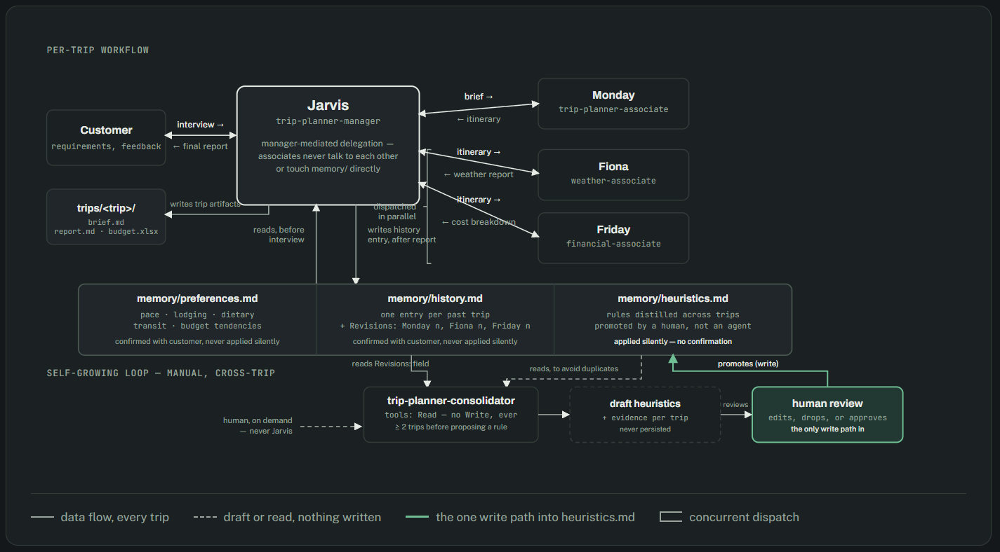
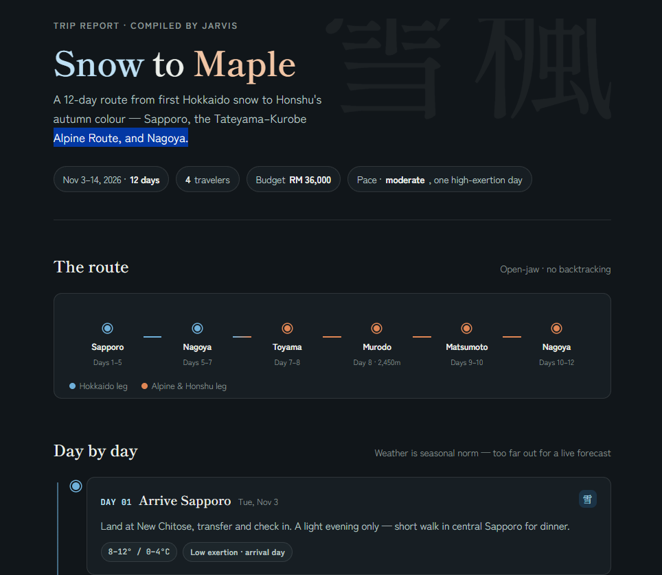

# Trip Planning

A multi-agent trip-planning workflow built on Claude Code subagents.

## How it works

Start a session and describe the trip you want planned — destinations,
dates, budget (optional), and travel style. Jarvis (`trip-planner-manager`)
is your single point of contact: it gathers your requirements, then
delegates to three specialists:

- **Monday** (`trip-planner-associate`) — builds the day-by-day route and
  itinerary.
- **Fiona** (`weather-associate`) — checks forecast/seasonal conditions per
  leg and flags risks.
- **Friday** (`financial-associate`) — builds the cost breakdown and
  compares it against your budget.

Jarvis reviews each associate's work, resolves conflicts between them, and
compiles everything into one cohesive report — never three stapled-together
documents.

## Where things live

- `.claude/agents/tripPlanWorkflow/` — the four agent definitions.
- `trips/<slug>/` — one folder per planned trip, holding the customer brief,
  the final compiled report, and the budget spreadsheet. See
  `trips/README.md` for the convention.

## Starting a trip

Just tell Claude Code what you want to plan (e.g. "Plan a 10-day trip to
Japan for two people in April, mid-range budget, focused on food and
culture") — Jarvis will take it from there.

## Using these agents in other projects (optional)

The agents in `.claude/agents/tripPlanWorkflow/` are project-scoped, so they
only apply when Claude Code runs inside this repo. To make them available
everywhere on your machine, copy them into your user-level Claude config
after cloning:

```bash
mkdir -p ~/.claude/agents/tripPlanWorkflow
cp .claude/agents/tripPlanWorkflow/*.md ~/.claude/agents/tripPlanWorkflow/
```

## Architecture Diagram



## Report Sample 

